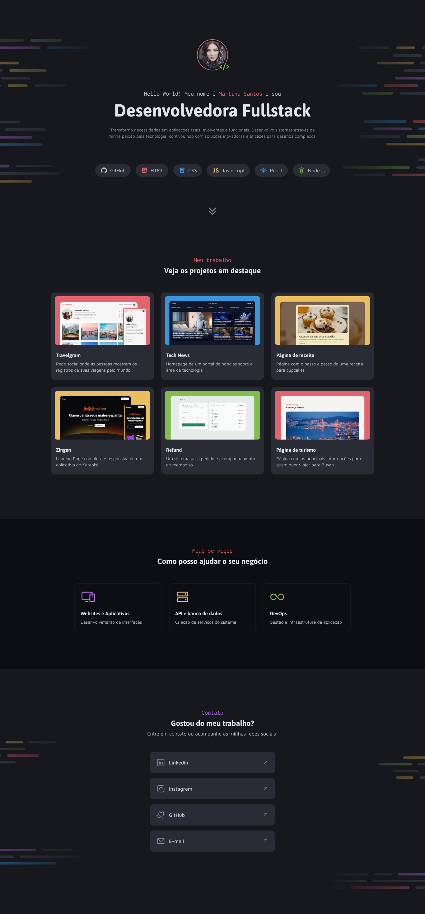

# Portfólio de Desenvolvedora Fullstack

Este é o site de portfólio. O site apresenta uma introdução, seus projetos de destaque, os serviços que oferece e informações de contato.

---

## Visão Geral

O portfólio é dividido em quatro seções principais:

* **Introdução**: Apresenta Martina Santos como desenvolvedora fullstack, sua paixão por tecnologia e sua habilidade de transformar necessidades em aplicações funcionais. Inclui tags com as tecnologias que ela domina, como GitHub, HTML, CSS, JavaScript, React e Node.js.
* **Projetos (Meu trabalho)**: Exibe uma galeria com seis projetos de destaque. Cada projeto tem uma imagem de miniatura, título e uma breve descrição. Os projetos incluem:
    * **Travelgram**: Uma rede social para compartilhar registros de viagens.
    * **Tech News**: A página inicial de um portal de notícias de tecnologia.
    * **Página de receita**: Uma página com uma receita de cupcakes.
    * **Zingen**: Uma landing page para um aplicativo de karaokê.
    * **Refund**: Um sistema para solicitações e acompanhamento de reembolso.
    * **Página de turismo**: Uma página com informações turísticas sobre Busan.
* **Serviços (Meus serviços)**: Detalha os serviços que Martina oferece, com ícones e descrições para cada um:
    * **Websites e Aplicativos**: Desenvolvimento de interfaces.
    * **API e banco de dados**: Criação de serviços de sistema.
    * **DevOps**: Gestão e infraestrutura de aplicações.
* **Contato**: Fornece links para as redes sociais e e-mail de Martina, permitindo que os interessados entrem em contato ou a sigam.

## Estrutura do Projeto

O projeto é construído usando HTML e CSS.

* `index.html`: O arquivo HTML principal que define a estrutura e o conteúdo do site.
* `styles/`: A pasta que contém os arquivos de estilo CSS.
    * `globals.css`: Define variáveis CSS para cores, tipografia e famílias de fontes, além de estilos globais para o projeto.
    * `utilitys.css`: Contém classes de utilidade para flexbox e grid.
    * `index.css`: Importa todos os outros arquivos CSS, servindo como o arquivo de estilo principal.
    * `intro.css`: Estilos específicos para a seção de introdução.
    * `works.css`: Estilos para a seção de projetos.
    * `services.css`: Estilos para a seção de serviços.
    * `contact.css`: Estilos para a seção de contato.
* `assets/`: Contém as imagens, ícones e outros recursos visuais usados no site.

---

## 🖥️ Tecnologias Utilizadas

* **HTML5**
* **CSS3**
* **Google Fonts**

---

## 📸 Prévia do Projeto

---

## 📄 Licença

Este projeto foi desenvolvido para fins educacionais e pode ser utilizado livremente.